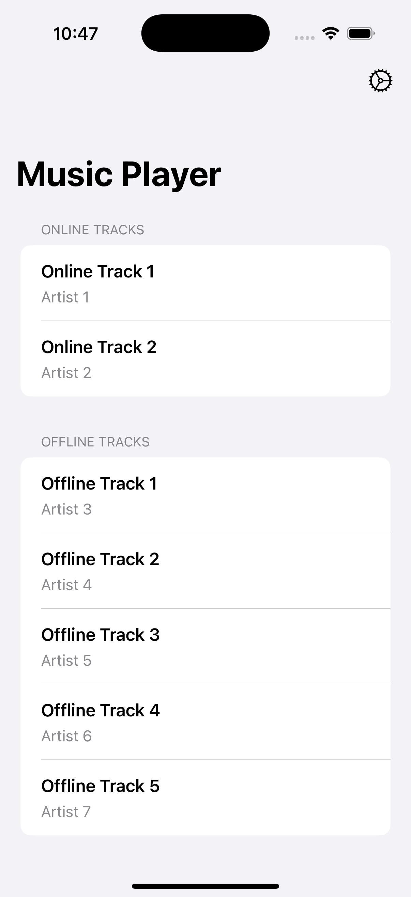
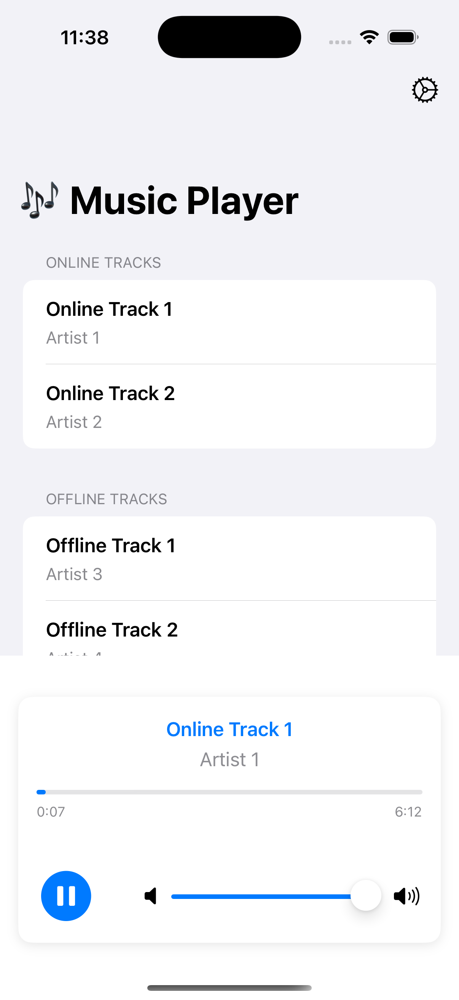
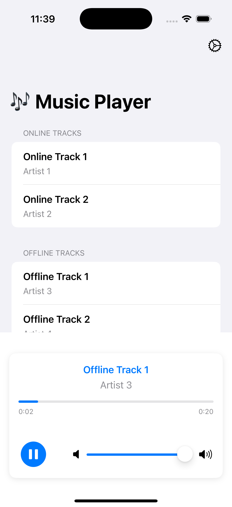
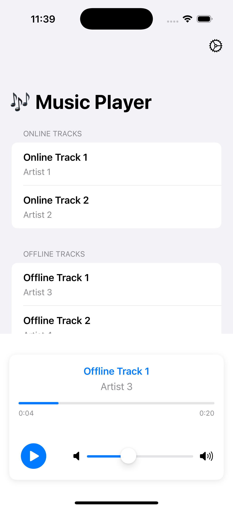

---

# 🎶 SwiftUI Music Player Demo

A simple, modern music player app built with **SwiftUI** and **MVVM architecture**.  
Supports both **online streaming** and **offline local playback**.  
Designed as a learning resource and a showcase for clients.

---

## ✨ Features

- **MVVM Architecture**: Clean separation of concerns.
- **SwiftUI**: Modern, declarative UI.
- **Online & Offline Tracks**: Play both remote and bundled audio files.
- **Audio Controls**: Play, pause, seek, and volume adjustment.
- **Progress Bar**: Visualize playback progress.
- **Error Handling**: User-friendly error messages.
- **Well-Commented Code**: Easy to follow and extend.

---

## 🚀 Getting Started

### 1. **Clone the Repository**
```sh
git clone https://github.com/kombee-technologies/MusicPlayerApp.git
cd swiftui-music-player-demo
```

### 2. **Open in Xcode**
- Open `MusicPlayerApp.xcodeproj` in Xcode (Xcode 14+ recommended).

### 3. **Add Offline Audio Files (Optional)**
- Place your `.mp3` files in the `MusicPlayerApp` target in Xcode.
- Make sure the filenames match the `url` property of your offline `TrackModel` (e.g., `"track1"` for `track1.mp3`).

### 4. **Build & Run**
- Select a simulator or your device.
- Press **Run** (⌘R).

---

## 🏗️ Project Structure

```
MusicPlayerApp/
├── Model/
│   └── TrackModel.swift         # Track data model
├── Services/
│   └── AudioService.swift       # Handles audio playback
├── ViewModel/
│   └── MusicPlayerViewModel.swift # Business logic & state
├── View/
│   └── PlayerView.swift         # Main UI
└── ... (Xcode project files)
```

---

## 📝 Code Overview & Comments

### **TrackModel.swift**
```swift
/// Represents a music track (online or offline)
struct TrackModel: Identifiable {
    let id: UUID
    let title: String
    let artist: String
    let url: String      // URL string or local filename (without .mp3)
    let isLocal: Bool    // true = bundled file, false = remote
}
```

### **AudioService.swift**
```swift
/// Handles all audio playback logic using AVPlayer
@MainActor
class AudioService: ObservableObject {
    // ... properties ...

    /// Play a track (online or offline)
    func play(track: TrackModel) { ... }

    /// Pause playback
    func pause() { ... }

    /// Resume playback
    func resume() { ... }

    /// Stop playback and reset
    func stop() { ... }

    /// Seek to a specific time
    func seek(to time: TimeInterval) { ... }

    /// Set playback volume
    func setVolume(_ volume: Float) { ... }
}
```

### **MusicPlayerViewModel.swift**
```swift
/// ViewModel for the music player, connects UI and AudioService
@MainActor
class MusicPlayerViewModel: ObservableObject {
    // ... properties ...

    /// Play a selected track
    func play(track: TrackModel) { ... }

    /// Toggle play/pause
    func togglePlayPause() { ... }

    /// Seek to a position
    func seek(to progress: Double) { ... }

    /// Clear any error
    func clearError() { ... }
}
```

### **PlayerView.swift**
```swift
/// Main UI for the music player
struct PlayerView: View {
    // ... properties ...

    var body: some View {
        // List of online and offline tracks
        // Playback controls (play/pause, volume)
        // Progress bar
        // Error alert
    }
}
```

---

## 🧑‍💻 How to Add More Tracks

- **Online:**  
  Add a new `TrackModel` with `isLocal: false` and a valid audio URL.

- **Offline:**  
  1. Add your `.mp3` file to the Xcode project (ensure it's in the app bundle).
  2. Add a new `TrackModel` with `isLocal: true` and `url` set to the filename (without `.mp3`).

---

## 🛠️ Customization

- **UI:**  
  Modify `PlayerView.swift` for layout, colors, and controls.
- **Audio Logic:**  
  Extend `AudioService.swift` for advanced features (background playback, playlists, etc).
- **Architecture:**  
  The code is modular and easy to extend for more features.

---

## 🧑‍🎓 Learning Points

- How to use **SwiftUI** for building modern UIs.
- How to structure an app with **MVVM**.
- How to use **AVFoundation** for audio playback.
- How to handle both **online streaming** and **offline files**.
- How to manage state and errors in SwiftUI.

---

## 📸 Screenshots

### 📝 Music List Screen

Offline and Online Song List

<p align="center">
  
</p>

### ✅ Online Track Play

Playing Track From Online

<p align="center">
  
</p>

### ✅ Offline Track Play

Playing Track From Offline

<p align="center">
  
</p>


### ✅ Play-Pause 

Pay-Pause Song 

<p align="center">
  
</p>

---

## 📄 License

MIT License.  
Feel free to use, modify, and share!

---

## 🙏 Credits

- [Apple Developer Documentation](https://developer.apple.com/documentation/)
- [SoundHelix](https://www.soundhelix.com/) for sample MP3 URLs

---

## 💬 Feedback

If you have suggestions or want to contribute, open an issue or pull request!

---

**Happy coding! 🎧**

---

Let me know if you want the README tailored for a specific repo name, or if you want to include more advanced usage or screenshots!

